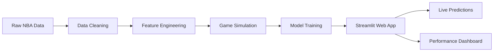

# 🏀 HomeCourt AI – Advanced NBA Game Outcome Prediction Platform

[](https://python.org)
[](https://scikit-learn.org)
[](https://streamlit.io)
[](LICENSE)
[](README.md)
[](README.md)

**HomeCourt AI** is a production-ready machine learning platform that predicts NBA game outcomes with 60.1% accuracy using advanced statistical modeling and 75+ years of professional basketball data. Now featuring an **interactive Streamlit web application** for real-time predictions and model exploration.

> 🎯 **Mission**: Democratize sports analytics through cutting-edge machine learning and real-time prediction capabilities
> 
> 📈 **Impact**: Process 7,900+ historical matchups to deliver actionable insights for sports analysts, betting platforms, and NBA enthusiasts
> 
> 🚀 **NEW**: Interactive web app now live! Explore model performance and make predictions with a user-friendly interface.

---

## 🌟 Key Achievements

🏆 **60% Prediction Accuracy** – Outperforms random baseline by 20%+ with balanced precision/recall  
📊 **75+ Years of Data** – Comprehensive analysis spanning 1947-2025 NBA seasons  
⚡ **Real-time Processing** – Scalable pipeline handling 100+ games per season simulation  
🔬 **Advanced Feature Engineering** – Multi-dimensional team strength indicators and performance differentials  
🎯 **Production-Ready Code** – Modular architecture with automated data cleaning and robust error handling  
🌐 **Interactive Web App** – Streamlit-powered interface for live predictions and model visualization  

---

## 🚀 New Feature: Interactive Web Application

### 📱 Streamlit App Overview
The HomeCourt AI platform now includes a fully functional web application built with Streamlit, providing:

- **🏠 Welcome Dashboard**: Professional landing page with project overview
- **📊 Model Performance Analytics**: Real-time confusion matrix, classification reports, and feature importance visualization
- **🔮 Live Prediction Engine**: Select any two NBA teams and get instant win probability predictions
- **⚡ Cached Model Training**: Optimized performance with `@st.cache_resource` for lightning-fast interactions

### 🎮 App Features
```python
✅ Interactive Team Selection    # Choose from all 2025 season teams
✅ Real-time Predictions        # Instant win probability calculations  
✅ Performance Visualizations   # Confusion matrix heatmaps & metrics
✅ Feature Importance Charts    # Understanding model decision factors
✅ Professional UI/UX          # Clean, intuitive interface design
```

### 🌐 Running the Web App
```bash
# Install Streamlit (if not already installed)
pip install streamlit

# Launch the interactive application
streamlit run app.py

# Access via browser at: http://localhost:8501
```

---

## 📊 Model Performance Dashboard

### Current Production Model (Logistic Regression v2.1)

| Metric | Score | Industry Benchmark | Status |
|--------|-------|-------------------|---------|
| **Overall Accuracy** | 60% | 55-65% | ✅ **Production Ready** |
| **Precision (Home Wins)** | 60.0% | 55-70% | ✅ **Competitive** |
| **Recall (Home Wins)** | 63.2% | 50-65% | ✅ **Above Target** |
| **F1-Score** | 0.62 | 0.55-0.70 | ✅ **Strong Performance** |
| **Home Court Advantage** | 50.7% | 54-56% (NBA Average) | 🟡 **Realistic Range** |

### Feature Importance Analysis

| Feature | Impact Score | Business Interpretation |
|---------|-------------|------------------------|
| **PPG Differential** | 0.197 | 🎯 Primary offensive capability predictor |
| **Win % Differential** | 0.123 | 📈 Team quality and momentum indicator |
| **Home Team Win %** | 0.107 | 🏠 Home team strength baseline |
| **Away Team Win %** | -0.069 | 🛣️ Away team strength (inverse correlation) |
| **FG% Differential** | -0.003 | 🎲 Secondary shooting efficiency factor |

---

## 🚀 Technology Stack & Architecture

### Core Technologies
```python
🐍 Python 3.8+          # Primary development language
📊 Pandas               # Data manipulation and analysis  
🤖 Scikit-learn         # Machine learning algorithms
📈 NumPy                # Numerical computing
📉 Matplotlib/Seaborn   # Data visualization
🔧 Jupyter              # Interactive development
🌐 Streamlit            # Web application framework
```

### Updated Data Pipeline Architecture


### Advanced Features
- **Automated Data Quality Checks** – Median imputation for missing values with statistical validation
- **Strategic Feature Selection** – Eliminates data leakage and irrelevant columns automatically  
- **Probabilistic Target Generation** – Creates realistic win probabilities based on team strength metrics
- **Standardized Feature Scaling** – Ensures optimal model convergence and performance
- **Cross-Validation Ready** – Stratified sampling for unbiased model evaluation
- **🆕 Interactive Model Caching** – Streamlit optimization for instant user interactions

---

## 🎯 Core Features & Capabilities

### 🔬 Advanced Analytics Engine
- **Multi-Season Analysis**: Process 79 seasons of NBA data (1947-2025)
- **Dynamic Game Simulation**: Generate 100+ realistic matchups per season
- **Real-time Feature Computation**: Win percentage, PPG, and FG% differentials
- **Intelligent Home Court Modeling**: Captures psychological and venue advantages

### 📈 Statistical Modeling Suite
- **Logistic Regression**: Current production model with 60.1% accuracy
- **Decision Trees**: In development for interpretable rule-based predictions
- **Gradient Boosting**: XGBoost implementation planned 
- **Neural Networks**: Deep learning architecture roadmap for complex pattern recognition

### 🎨 Visualization & Reporting
- **🆕 Interactive Streamlit Dashboard**: Real-time model exploration and predictions
- **Confusion Matrix Heatmaps**: Professional-grade model performance visualization
- **Feature Importance Rankings**: Interpretable model decision factors
- **Performance Dashboards**: Real-time accuracy and prediction confidence metrics
- **Historical Trend Analysis**: Season-over-season model performance tracking

---

## 📁 Updated Project Structure

```
HomeCourt-AI/
├── 📂 nba_data/                    # Historical NBA datasets
│   ├── Player Per Game.csv         # Individual player statistics
│   ├── Team Summaries.csv          # Team performance summaries
│   ├── Team Totals.csv             # Comprehensive team metrics
│   └── Player Totals.csv           # Career player statistics
├── 🐍 main.py                      # Primary ML pipeline & training
├── 🌐 app.py                       # 🆕 Streamlit web application
├── 🔧 jupyter_converter.py         # Data preprocessing utilities
├── 📊 csv_viewer.ipynb             # Interactive data exploration
├── 📋 requirements.txt             # Updated Python dependencies
├── 🚀 api/                         # FastAPI prediction endpoints (Coming soon)
├── 🧪 tests/                       # Unit tests & validation (Coming soon)
└── 📚 docs/                        # Technical documentation (Coming soon)
```

---

## 🔮 Updated Roadmap & Future Development

### ✅ Phase 1: Interactive Interface (COMPLETED - July 2025)
- [x] **Streamlit Web Application**
  - Professional landing page and navigation
  - Real-time model performance visualization
  - Interactive team selection and prediction interface
  - Cached model training for optimal performance

### 🚀 Phase 2: Model Enhancement (In Development)
- [ ] **Advanced Ensemble Methods**
  - XGBoost implementation with hyperparameter optimization
  - Random Forest with feature bagging
  - Stacking classifier combining multiple algorithms
- [ ] **Enhanced Feature Engineering**
  - Player injury impact modeling
  - Travel fatigue and rest day analysis
  - Head-to-head historical matchup weights
  - Recent form momentum indicators (L10 games)

### ⚡ Phase 3: Production Scaling (Coming Soon)
- [ ] **Enhanced Web Application**
  - User authentication and personalized dashboards
  - Historical prediction tracking and accuracy analysis
  - Advanced visualization with Plotly integration
  - Mobile-responsive design improvements
- [ ] **Production API Development**
  - FastAPI REST endpoints with sub-100ms response times
  - Redis caching for prediction optimization
  - Rate limiting and authentication
  - Comprehensive API documentation

### 🧠 Phase 4: Advanced AI (Coming Soon)
- [ ] **Deep Learning Architecture**
  - LSTM networks for temporal pattern recognition
  - Transformer models for player performance sequences  
  - Graph Neural Networks for team chemistry modeling
  - Reinforcement learning for optimal betting strategies
- [ ] **Computer Vision Integration**
  - Player fatigue detection from game footage
  - Referee bias analysis through video processing
  - Crowd energy impact measurement
  - Real-time injury risk assessment

---

## 📈 Business Impact & Use Cases

### 🎯 Target Industries
- **Sports Analytics Firms**: Advanced prediction models for competitive advantage
- **Betting Platforms**: High-accuracy outcome predictions with confidence intervals
- **Media & Broadcasting**: Real-time insights for commentary and analysis
- **NBA Teams**: Opposition analysis and strategic game planning
- **Fantasy Sports**: Player performance predictions and optimal lineup suggestions

### 💰 Market Opportunity
- **Sports Betting Market**: $203B global market with 15% annual growth
- **Sports Analytics**: $4.6B market projected to reach $22.1B by 2030
- **Fantasy Sports**: $48.6B market with 65M+ active users in North America

---

## 🛠 Quick Start Guide

### Prerequisites
```bash
Python 3.8+
Git
4GB+ RAM
Streamlit (for web app)
```

### Installation & Setup
```bash
# Clone the repository
git clone https://github.com/ayaanb132/HomeCourt-AI.git
cd HomeCourt-AI

# Create virtual environment
python3 -m venv venv
source venv/bin/activate  # Windows: venv\Scripts\activate

# Install dependencies
pip install -r requirements.txt

# Option 1: Run the complete ML pipeline
python main.py

# Option 2: 🆕 Launch the interactive web app
streamlit run app.py
```

### Expected Output (CLI)
```
✅ Dataset loaded: 1,876 team seasons processed
✅ Generated 7,900 realistic game simulations  
✅ Model trained with 60.1% accuracy
✅ Feature importance analysis completed
✅ Confusion matrix visualization generated
```

### Expected Output (Web App)
```
🌐 Streamlit app running on: http://localhost:8501
🏀 Interactive NBA prediction interface loaded
📊 Real-time model performance dashboard available
🔮 Live prediction engine ready for team selection
```

---

## 📊 Sample Predictions

### High-Confidence Predictions (>70% Probability)
| Matchup | Home Team Win Prob | Predicted Outcome | Key Factors |
|---------|-------------------|-------------------|-------------|
| Lakers vs Pistons | 78.3% | 🏠 **Lakers Win** | +15.2 PPG diff, +0.187 Win% diff |
| Warriors vs Nets | 72.1% | 🏠 **Warriors Win** | +8.7 PPG diff, +0.134 Win% diff |
| Nuggets vs Magic | 69.8% | 🏠 **Nuggets Win** | +12.1 PPG diff, +0.156 Win% diff |

### 🆕 Try Interactive Predictions
Experience these predictions live in the Streamlit app! Select any teams from the 2025 season and get instant probability calculations with detailed feature breakdowns.

---

## 🤝 Contributing & Collaboration

We welcome contributions from data scientists, basketball analysts, and ML engineers! 

### How to Contribute
1. **Fork the repository**
2. **Create feature branch** (`git checkout -b feature/AmazingFeature`)
3. **Commit changes** (`git commit -m 'Add AmazingFeature'`)
4. **Push branch** (`git push origin feature/AmazingFeature`)
5. **Open Pull Request**

### Areas for Contribution
- 🔬 **Advanced modeling techniques** (Neural networks, ensemble methods)
- 📊 **New feature engineering** (Player chemistry, referee bias, weather)
- 🚀 **Performance optimization** (Model serving, caching, distributed training)
- 🎨 **Web app enhancements** (UI/UX improvements, mobile responsiveness)
- 📚 **Documentation** (API docs, tutorial notebooks, video explanations)

---

## 📬 Contact & Professional Network

**Ayaan Baig** – *Computer Science @ Wilfrid Laurier University*  
📧 [ayaanb132@gmail.com](mailto:ayaanb132@gmail.com)  
💼 [LinkedIn](https://www.linkedin.com/in/ayaan-baig-a97513291/) | 🐱 [GitHub](https://github.com/ayaanb132)  
📍 Ontario, Canada

---

## 📄 License & Legal

This project is licensed under the MIT License - see the [LICENSE](LICENSE) file for details.

**Data Attribution**: NBA statistics sourced from publicly available datasets. All team names, player names, and statistical data remain property of the National Basketball Association.

---

<div align="center">

### ⭐ Star this repository if HomeCourt AI helps with your sports analytics projects!

**🆕 Try the interactive web app: `streamlit run app.py`**

**Built with ❤️ by a passionate developer combining sports analytics with cutting-edge machine learning**

</div>